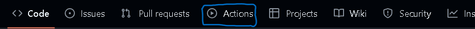

# Github Actions

[Anterior: Colaboração](Colaboração.md)

## O que é GitHub Actions?

O GitHub permite, por meio das Actions, automatizar fluxos de trabalho (Workflows) de integração contínua e entrega contínua (CI/CD) no seu repositório.

Essa automatização pode ser ativada a partir de eventos específicos como: pull requests, issues, commits, pushes, etc.

Os Workflows têm o poder de automatizar processos como building, teste e deployment de código em ambientes de execução baseados em vários sistemas operacionais.

Ademais, as Actions criadas são reutilizáveis, permitindo melhor aproveitamento e recursos.

## Criando um Workflow

Para especificar um Workflow, você deve criar um diretório chamado `.github/Workflows` no seu repositório.

Cada Workflow é configurado a partir de um arquivo `.yml` disponibilizado nessa pasta.

### Exemplo de Workflow

```yaml
# .github/Workflows/myWorkflow.yml
name: myWorkflow

# Eventos de ativação do Workflow
on: [pull_request]

# O que deve ser realizado pelo Workflow
jobs:
    # Workflow para a build do projeto
    build: 
        # Ambiente a ser utilizado
        runs-on: ubuntu-latest

        # Passos a serem utilizados
        steps:
            # Nome do step e action utilizada
            - name: Checkout Code
              uses: actions/checkout@v3

            # A action checkout clona o repositório 
            # no ambiente de execução

            # Action para setar o Python
            - name: Set up Python
              uses: actions/setup-python@v5
              with:
                python-version: '3.11'

            # Action para chechar se o python foi
            # instalado
            - name: Display python version
              run: python -c "import sys; print(sys.version)"
```

### Entendendo o exemplo

                 
Neste exemplo, criamos um Workflow chamado **myWorkflow** a partir do arquivo `myWorkflow.yml`, localizado na pasta `.github/Workflows`.

Vamos entender o que foi configurado:

1. `name`: o nome do Workflow;
2. `on`: eventos que ativam o Workflow. Nesse caso, setamos para `pull_request`, ou seja, a cada PR feita, a Action é executada;
3. `jobs`: aqui setamos as tarefas a serem executadas:
4. `build`: nome do job que criamos;
>[!NOTE]
>Sempre seja objetivo ao nomear jobs
5. `runs-on`: define o ambiente (máquina virtual) em que nosso código será executado;
6. `steps`: passo a passo que forma o job. Cada step tem um nome e pode usar uma action já buildada com o `uses`, ou rodar um comando com o `run`.

### Rodando e monitorando Actions

Agora, basta realizar um commit e um push para seu repositório e pronto! Qualquer PR realizada em seu repositório ativará o Workflow. 

Na página do seu repositório, é possível ver as actions no aba **Actions** do menu principal.


*Aba Actions*

Nessa aba você pode criar, avaliar, atualizar e monitorar seus Workflows tranquilamente.


## Conclusão

Não entrarei a fundo em GitHub Actions. Por aqui finalizo (por enquanto) Git e GitHub. Caso haja alguma atualização no futuro, realizarei.

[Voltar ao início](Introdução.md)