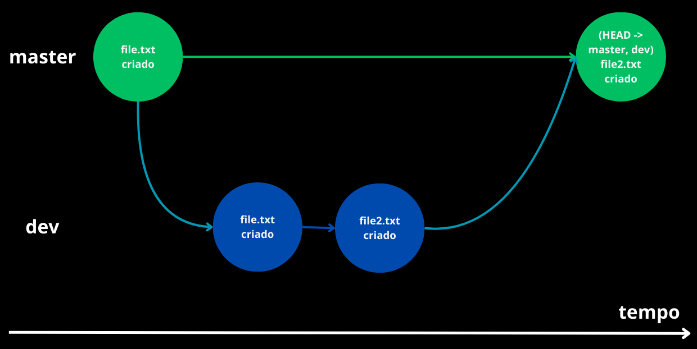

# Branch

[Anterior: Repositório](Repositório.md)
[Próximo: GitHub](GitHub.md)

Como sabemos, o Git conecta os commits uns aos outros para manter a ordem cronológica das alterações realizadas no projeto, criando assim uma árvore de commits. 

Esta árvore é dividida em *branches* (galho em inglês), que representam diferentes linhas cronológicas do projeto. Quando você cria um repositório, é criado também um branch padrão chamado `master`, que representa a linha central.

Sua utilização é mais fácil de entender a partir da imagem abaixo:


Como vemos na imagem, a partir do segundo commit feito no branch `master`, foi criado um novo branch chamado `new_feature`. Após a implementação da nova funcionalidade no novo branch, o usuário une o branch `new_feature` ao `master`, por meio de um `merge`. 

Assim, o branch principal apenas recebeu a funcionalidade pronta, sem ter que passar pelos estados intermediários. Isso é bom quando o branch principal é espelho para uma aplicação rodando e não pode ser alterado com frequência. Um branch permite atualizar a aplicação sem atrapalhar a que já está rodando.

Agora vamos à prática. Crie um novo branch chamado `dev` com o seguinte comando:

```bash
git branch dev
```

Agora, para ver todos os branches criados, rode:

```bash
git branch -l
```

Seu output deve ser esse:

```bash
$ git branch -l
  dev
* master
```

O `*` antes do branch `master` nos diz que estamos neste branch. Para trocar de branch, usamos o comando:

```bash
git checkout dev
```

> Caso queira criar um branch e trocar para ele de uma vez só, use `git checkout -b [nome-do-novo-branch]`

Deve aparecer a mensagem `Switched to branch 'dev'` após o comando. Caso queira confirmar, basta usar o `git branch -l` para ver o asterisco antes do nome `dev`.

Agora observe o seu repositório: houve alguma mudança? Não? Exato. Quando criamos um novo branch, geramos uma cópia do branch original. 

Agora faremos as alterações que quisermos. Crie um novo arquivo chamado `file2.txt` e escreva qualquer coisa nele. Agora, adicione tudo ao `index`, e faça um commit. 

Agora, os dois branches são diferentes. Embora o branch `dev` derive do `master`, modificamos o `dev`ao adicionar um novo arquivo. Para confirmar isto, basta trocar para o branch `master`:

```bash
git checkout master
```

Olhe seu diretório: **o arquivo `file2.txt` não está lá.** São dois branches diferentes agora. Mas vamos uní-los a partir de um merge.

## Merging

Fazer merge significa "incorporar as alterações de um branch específico no branch atual". No caso do nosso exemplo, queremos incorporar as atualizações feitas no branch `dev` no branch `master`. Para isso, entre no `master`:

```bash
git checkout master
```

E rode o seguinte comando:

```bash
git merge dev
```

E pronto!! Agora o arquivo `file2.txt` foi incorporado ao `master`. Como já incorporamos a atualização, é uma boa prática excluir o branch `dev` para simplificar o workflow do projeto.




[Anterior: Repositório](Repositório.md)
[Próximo: GitHub](GitHub.md)