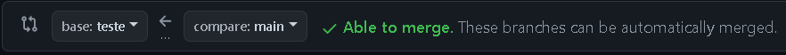

# Colaboração

[Anterior: GitHub](GitHub.md)
 
[Próximo: GitHub Actions](Actions.md)

## Colaborando no GitHub

O GitHub oferece várias ferramentas que permitem a colaboração entre desenvolvedores, como:

- forks;
- pull requests;
- issues;

Por meio dessas ferramentas, é possível acelerar tremendamente o tempo de desenvolvimento de projeto e manter histórico das atualizações do projeto. 

Vamos tratar cada uma dessas ferramentas neste tutorial.

## Forks

Um Fork é uma cópia de um branch de um repositório de outro perfil. 

Digamos que, em um projeto de software, você identifica um problema nos arquivos. Para corrigir, você faz um Fork desse projeto (copia o branch com o problema para seu perfil), e o corrige localmente, para depois propor uma alteração (pull request).

### Fazendo um Fork

Para fazer um fork, siga os seguintes passo:

1. Vá até ao repositório desejado e clique em "Fork", no canto superior direito. 

> [!NOTE]
> Não é possível fazer forks de seu próprio branch, já que você é o dono.

2. Clique em "Criar um novo fork", e será aberta uma página na qual você pode definir o nome (o nome do branch original como padrão) e descrição.
3. Agora é só usar um `git pull` para copiar o projeto localmente e trabalhar na solução.

## Pull requests (PRs)

Essa é uma das principais ferramentas relacionadas à colaboração no GitHub. Como o nome sugere, é um pedido de alteração de branch, *um pedido de merge*.

Digamos que, após fazer um fork e corrigir um problema num repositório de outro perfil, você deseja enviar as alterações feitas para ele, para que sejam integradas no projeto principal. Para isso, você faz uma pull request. 

### Criando uma pull request

Para criar uma PR, faça o seguinte:

1. Vá na aba "Pull requests", no menu original, e clique no botão "Nova pull request". 
2. Agora, escolha os branches que você quer comparar. **Eles devem ser diferentes, e o compare deve ter commits a frente do base**.

	*Selecionando branches*
3. Agora que você selecionou os branches, clique em "Criar pull request". Vão ser pedidos um título e uma descrição do pedido de merge. E pronto!

Se a PR foi feita para um outro usuário, esse usuário vai olhar as alterações feitas e decidir se faz o merge ou não.

Caso a PR tenha sido feita à você, e você:
- quiser integrar as alterações ao seu repositório, clique no botão "Merge pull request" no página da pull request e depois em "Confirm merge";
- não quiser integrar as alterações, basta fechar a PR clicando no botão "Close pull request".

Importante ressaltar que se pode comentar numa PR, o que torna discussões possíveis.

## Issues

Issues são basicamente "comentários" que podem ser usados de  diversas formas para aumentar a produtividade de um time e gerar discussões acerca do projeto. 

Entre os usos das Issues, temos:

- controle de tarefas;
- documentação;
- apontamento de bugs;
- sugestão de melhorias;

### Criando uma Issue

Para criar uma issue, siga os passos abaixo:

1. Vá até a aba "Issues" no repositório.
2. Clique no botão "New issue".
3. Preencha o título e a descrição da issue. Seja claro na descrição para facilitar o entendimento.
4. É possível categorizar issues com labels e até mencionar perfis com um "@" seguido do nome do perfil.
5. Clique em "Submit new issue" para cria-la.

É possível fechar issues, reabri-las caso necessário e usá-las das mais diversas formas. Uma issue é o meio de colaboração mais prático e versátil que veremos.

## Conclusão

Ainda temos as Actions no GitHub, mas esse é um tópico um pouco mais complexo, que veremos em outro tutorial.

[Anterior: GitHub](GitHub.md)
 
[Próximo: GitHub Actions](Actions.md)
