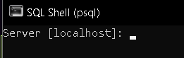
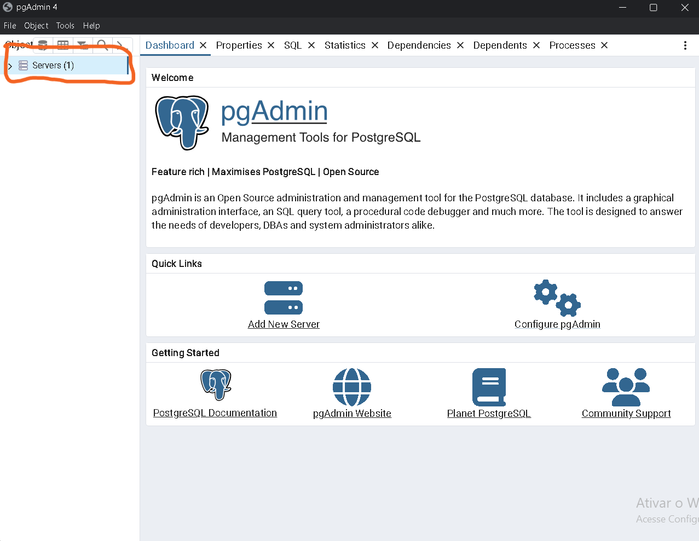
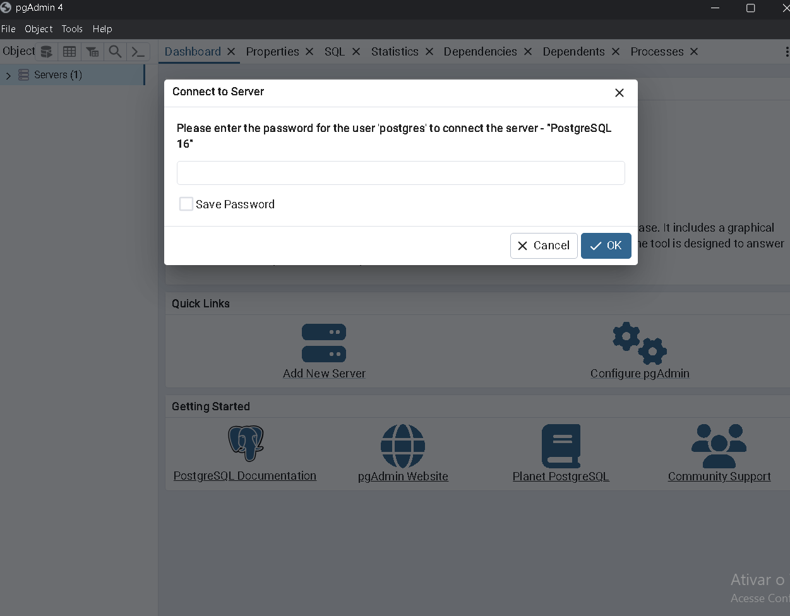
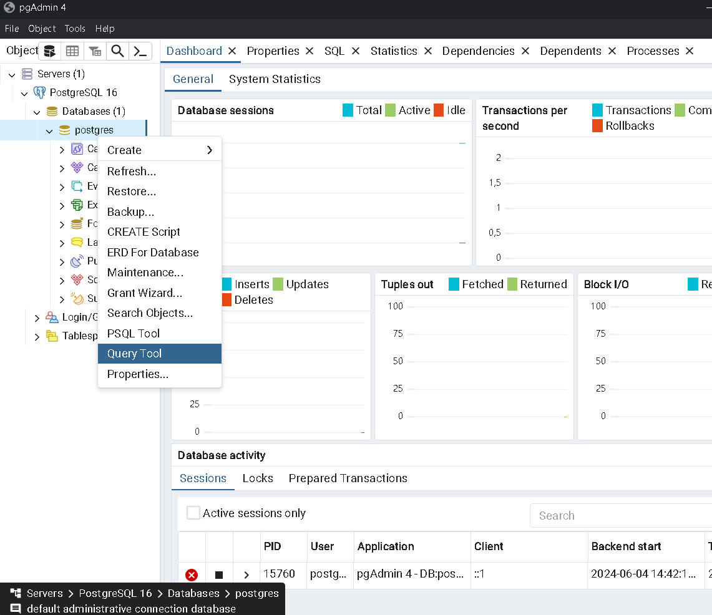
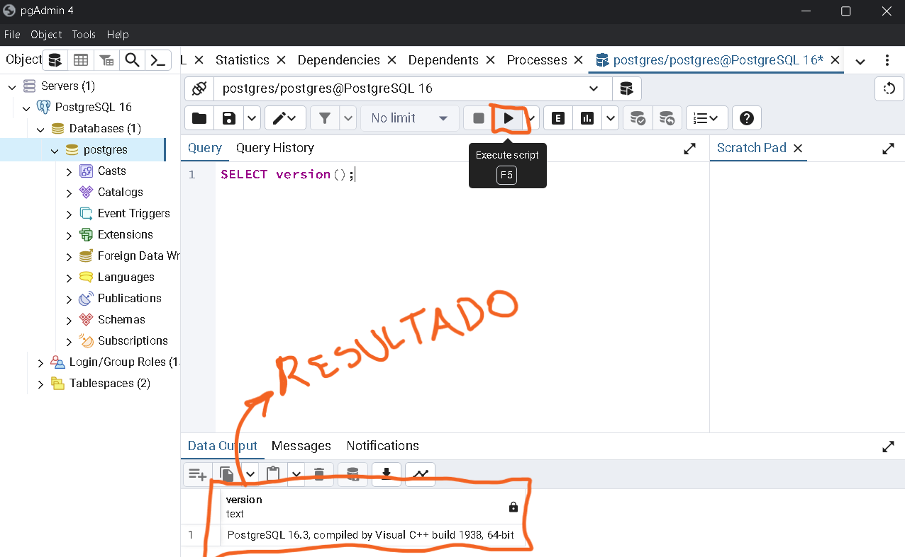

# Configurando

[Anterior: Instalação](Instalação.md)
[Próximo: SQL](SQL.md)

## Introdução

Há duas formas de se usar SQL agora:

- SQL Shell, ou psql (via terminal);
- pgAdmin.

Veremos a configuração das duas, entretanto, neste tutorial, utilizaremos predominantemente o SQL Shell.

Caso deseje utilizar o pgAdmin, aprenda a utilizá-lo [por aqui](pgAdmin.md).

## SQLShell

Para configurar seu ambiente PostgreSQL via SQL Shell, siga os seguintes passos:

1. Abra o SQL Shell (busque nos aplicativos de seu computador)

2. Ao abrir, você verá um terminal como a imagem abaixo:

A opção entre [ ] é a opção padrão (escolheremos ela).

3. Aperte enter para cada opção até que o terminal peça a senha.
    ```bash
    Server [localhost]:
    Database [postgres]:
    Port [5432]:
    Username [postgres]:
    Senha para o usuário postgres:
    ```

4. Digite a senha que você definiu durante a instalação.

5. Caso tenha funcionado, você terá um output parecido com esse:

    ```bash
    Server [localhost]:
    Database [postgres]:
    Port [5432]:
    Username [postgres]:
    Senha para o usuário postgres:
    psql (16.3)
    ADVERTÊNCIA: A página de código da console (850) difere da página de código do Windows (1252)
                os caracteres de 8 bits podem não funcionar corretamente. Veja a página de
                referência do psql "Notes for Windows users" para obter detalhes.
    Digite "help" para obter ajuda.

    postgres=#
    ```

> [!NOTE]
> Você terá que fazer esse processo todas as vezes que abrir o SQL Shell

## pgAdmin

Para configurar seu pgAdmin, siga os passos abaixo:

1. Abra o pgAdmin (busque nos aplicativos de seu computador)

2. Após abrir o aplicativo, clique em *Servers* no canto superior esquerdo.


3. Deve aparecer um prompt pedindo a senha que você definiu na instalação. Caso não apareça, clique em *PostgreSQL 16*.


4. Após fazer o login, o pgAdmin estará configurado. Caso queira testar comandos SQL, use a Query Tool do pgAdmin.


5. Escreva `SELECT version();` no campo de texto e aperte F5 (ou clique no local marcado na imagem).


## Conclusão

Agora que já instalamos e configuramos o necessário, vamos iniciar os trabalhos com SQL.

[Anterior: Instalação](Instalação.md)
[Próximo: SQL](SQL.md)
