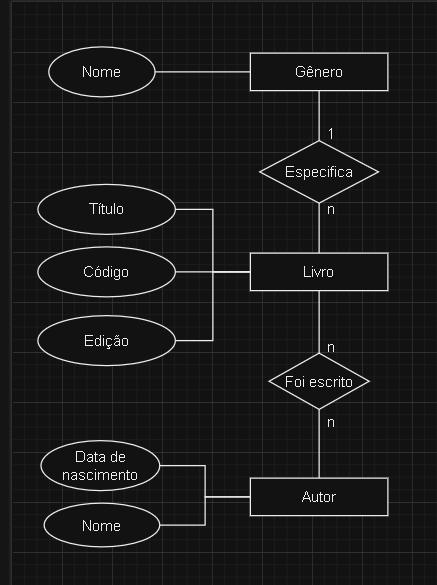

# Diagrama ER

[Anterior: Estruturando](Estruturando.md)
 
[Próximo: Normalização](Normalização.md)

## Introdução

Para melhor visualização do MER, foi criado o *Diagrama Entidade-Relacionamento* (DER). No DER, representamos os conceitos do MER por meio de formas geométricas.

## Formas

Para fazer a modelagem, usamos as seguintes figuras:

- **Retângulo**: representa entidades;
- **Círculo**: representa atributos;
- **Losango**: representa um relacionamento;
- **Linha**: liga as estruturas acima.

Para entender melhor, analise o DER feito a partir do exemplo visto no tópico anterior:

 
[Imagem alternativa](https://arquivo.devmedia.com.br/artigos/Joel_Rodrigues/mer/image004.png)

Este DER foi criado a partir da ferramenta [draw.io](https://app.diagrams.net).

## Analisando o Diagrama

- A entidade Livro possui três atributos não relacionais: título, código e edição;
- A entidade Gênero possui o atributo Nome;
- A entidade Autor possui os atributos Nome e Data de Nascimento;
- Entre as entidades Livro e Autor existe o relacionamento "Foi escrito", cuja cardinalidade é n:n (muitos para muitos);
- Entre as entidades Livro e Gênero existe o relacionamento "Especifica", cuja cardinalidade é 1:n (um para muitos).

## Conclusão

Um DER ajuda muito na criação e visualização da estrutura de seu banco de dados. Ainda sobre estruturação, veremos como normalizar seu banco no próximo tópico.

[Anterior: Estruturando](Estruturando.md)
 
[Próximo: Normalização](Normalização.md)
